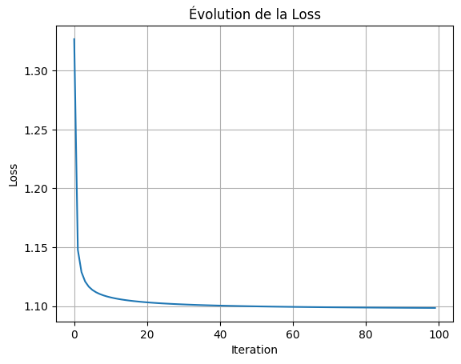

#  Softmax classification - wine quality Prediction

## Project Description
First implementation of softmax classificaion algorythm from scratch to predict wine quality based on features such as pH, acidity and others. This project includes feature selection, model training, and comprehensive visualization. The model is first implemented manually from scratch and then using libraries. The goal of the manual implementation is to deepen my understanding of softmax classification method.

## Key Features
- Feature Selection: from multiple chemical factors of the wine
- Softmax classification: implementation with sklearn library and manual implementation
- Data Visualization with matplotlib and pandas

## Selected Features
- fixed acidity
- volatile acidity
- citric acidity
- residual sugar
- chlorides
- free sulfure dioxyde
- total sulfure dioxyde
- density
- pH
- sulfate
- alcohol

## Results Summary with sklearn library
- accuracy of 0.61 for red wine
- accuracy of 0.53 for white wine
- This model isn't trustable, we barely have 1 chance over 2 that the prediction is wrong.

## Results Summary with manual implementation
- accuracy of 0.59 for red wine
- accuracy of 0.50 for white wine
- We have the same conclusion.

## Courbe des pertes

